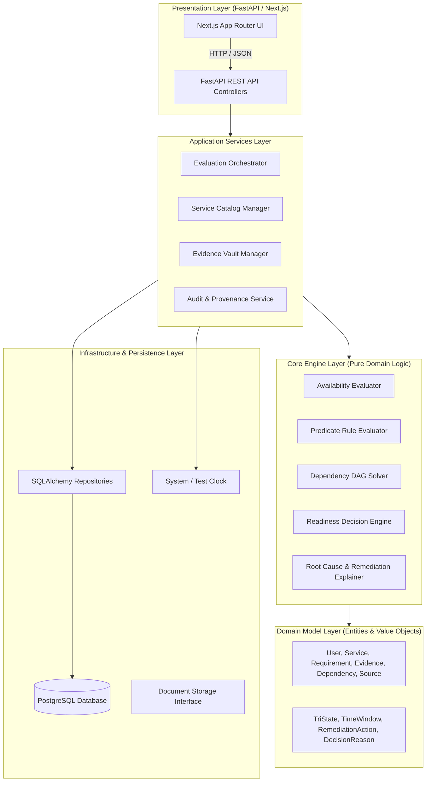
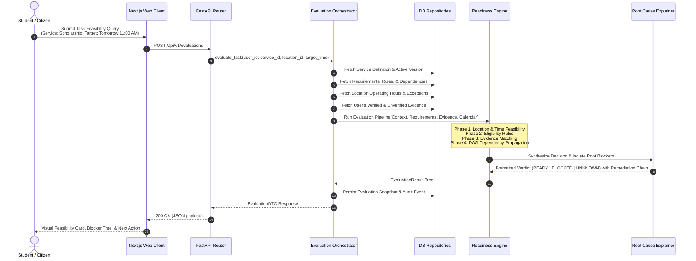

# Architecture Design Document: PREQVIA

**System**: PREQVIA (Real-World Task Completion Feasibility Engine)  
**Author**: Lead Software Architect  
**Status**: APPROVED / ARCHITECTURAL BASELINE  
**Version**: 1.0.0  
**Date**: 2026-10-07  

---

## 1. Executive Summary & Core Purpose

PREQVIA is a deterministic, explainable, and domain-agnostic decision engine designed to answer one question:

> **"Given this person, this task, this service, this location, and this time, can this task actually be completed?"**

The engine evaluates real-world conditions—eligibility criteria, prerequisite documents, administrative approvals, operational hours, institutional schedules, and multi-tier dependencies—and outputs a definitive tri-state outcome:

- `READY`: All conditions are proven to be satisfied.
- `BLOCKED`: One or more conditions are definitively unsatisfied, with root causes and upstream dependency chains isolated.
- `UNKNOWN`: Critical information is missing or unverifiable, preventing a definitive answer without guessing.

### 1.1 Non-Negotiable Architectural Principles

1. **Deterministic Core**: Given identical inputs (subject evidence, service rules, temporal context), the engine must produce an identical evaluation tree and decision every time.
2. **Tri-State Rigor (Kleene 3-Valued Logic)**: `UNKNOWN` is never collapsed into `BLOCKED`. If an evidence expiration date or verification signature cannot be confirmed, it is reported as `UNKNOWN` with actionable steps to resolve the uncertainty.
3. **No Hidden Logic in API or UI**: The engine is a pure domain service. Neither HTTP handlers, database queries, nor frontend components participate in evaluating feasibility.
4. **AI Separation**: The decision engine does not use LLMs, heuristic probabilistic models, or vector searches. AI may be layered in later strictly as an *intake assistant* (e.g., parsing raw PDFs into structured claims), but the core engine remains 100% deterministic code.
5. **Domain Agnosticism**: While initial fixtures model college administrative workflows (scholarships, bonafide certificates, fee verification), all rules, requirements, and dependencies are modeled as data and graph structures. No college-specific logic exists in the engine code.

---

## 2. High-Level Architecture: Modular Monolith

PREQVIA is organized as a **clean-architecture modular monolith** to avoid premature microservice overhead, network latency, distributed transactions, and operational complexity while enforcing strict bounded contexts.

### 2.1 Architectural Layers

| Layer | Responsibility | Dependencies |
| :--- | :--- | :--- |
| **Domain** | Immutable definitions of entities, value objects, domain events, and pure business invariants. Free of framework code. | None (standard Python libraries only). |
| **Engine** | Graph resolution, DAG topological sorting, Kleene tri-state algebraic reduction, temporal constraint checking, and root-cause isolation. | Depends only on Domain. |
| **Application** | Use-case orchestration, transaction boundaries, coordinating repositories, audit logging, and input validation. | Depends on Domain and Engine. |
| **Infrastructure** | Database access (SQLAlchemy, Alembic), file storage, external clock, serialization. | Implements interfaces defined in Domain/Application. |
| **API** | HTTP routing, authentication/authorization middleware, request deserialization, OpenAPI schema documentation. | Depends on Application. |
| **Frontend** | Modern Next.js interface providing interactive task feasibility queries, requirement breakdown, and visual dependency graphs. | Communicates via HTTP API only. |

---

## 3. Component Boundaries & Interaction Flow

---

## 4. Key Architectural Decisions

1. **Modular Monolith over Microservices**: Single deployable backend application containing clean internal modules (`auth`, `catalog`, `evidence`, `engine`, `evaluations`). Zero cross-service RPC overhead.
2. **Directed Acyclic Graph (DAG) for Dependencies**: Requirements and sub-tasks form a formal DAG. Cycle detection is enforced at service definition time via Tarjan's or Kahn's algorithms.
3. **Temporal Invariance and Version Pinning**: Services and requirements evolve over time. Evaluations always record the exact `service_version_id` and rule snapshot evaluated, ensuring historical audits reproduce the exact same outcome.
4. **Decoupled Requirement vs. Evidence**: A requirement is a declarative specification of *what is demanded*. An evidence item is an assertion of *what is held*. A deterministic validator matches evidence to requirement specifications.
5. **Actionable Remediation Modeling**: Every `BLOCKED` or `UNKNOWN` state yields a discrete, structured `NextAction` with step order, avoiding vague errors.

---

## 5. Technology Stack Specification

| Component | Target Technology | Justification |
| :--- | :--- | :--- |
| **Backend Language** | Python 3.12+ (tested with 3.14 compatible syntax) | Rich typing system, concise domain expressions, native support for algebraic data structures and graph algorithms. |
| **API Framework** | FastAPI | High-performance async ASGI framework with native Pydantic v2 schemas and OpenAPI 3.1 generation. |
| **ORM / Data Access** | SQLAlchemy 2.0 (Async) | Industry standard Python ORM supporting unit-of-work patterns, async drivers, and declarative type annotations. |
| **Migrations** | Alembic | Production-grade schema versioning and deterministic DDL migration scripts. |
| **Database** | PostgreSQL 16+ | ACID compliance, JSONB indexing for flexible rule definitions, robust constraint enforcement, and temporal interval support. |
| **Frontend Framework** | Next.js (App Router, React 19, TypeScript) | Server-Side Rendering for fast initial load, strict type safety, modular component hierarchy. |
| **Containerization** | Docker & Docker Compose | Multi-container local orchestration (Postgres, FastAPI backend, Next.js frontend) ensuring reproducible dev environments. |
