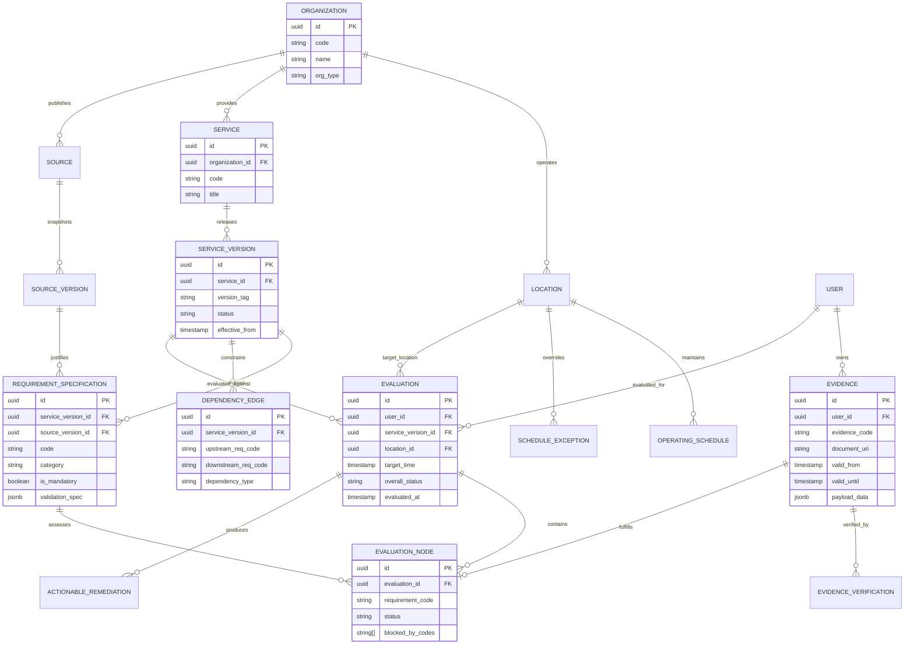

# Domain Model Specification: PREQVIA

**System**: PREQVIA  
**Document**: Domain Model Specification  
**Status**: APPROVED / ARCHITECTURAL BASELINE  
**Version**: 1.0.0  
**Date**: 2026-10-07  

---

## 1. Domain Taxonomy Critique & Refinements

The initial domain entities proposed in Section 6 have been critically evaluated against real-world administrative constraints, temporal physics, and auditability requirements.

### 1.1 Critique Matrix: Missing, Merged, and Separated Entities

| Entity in Initial List | Architectural Decision | Rationale & Refinement |
| :--- | :--- | :--- |
| **User** | **Separated into `User` & `SubjectContext`** | A user running the evaluation may not be the subject. For instance, a college administrative clerk or parent might test feasibility for a student. `SubjectContext` captures the applicant whose eligibility is being evaluated, while `User` captures the authenticated actor. |
| **Task** vs **Service** | **Clarified & Distinguished** | A **`Service`** is the provider's formal capability (e.g., "Post-Matric Merit Scholarship Submission"). A **`Task`** (or `UserTaskIntent`) is the user's specific attempt or instance (e.g., "Submit Application for Academic Year 2026-2027 by March 15"). Services are defined by institutions; tasks are created by or for users. |
| **Requirement** | **Separated into `RequirementSpecification` vs `RequirementNode`** | `RequirementSpecification` is the immutable catalog template defined by an organization (e.g., "Must possess Bonafide Certificate issued within 6 months"). A `RequirementNode` is an evaluation-time instance evaluated against user-specific state. |
| **Rule** | **Refined as Predicate Model on Requirements** | Rules are not disconnected entities floating in isolation. A `Rule` is either: (1) an **Applicability Condition** (e.g., "Requirement X only applies IF student category == 'OBC'"), or (2) an **Eligibility Constraint** (e.g., "Annual family income < 250,000 INR"). |
| **Evidence** | **Augmented with `EvidenceVerificationRecord`** | Evidence alone is an assertion (e.g., an uploaded file or self-declared value). Real-world institutions require provenance and verification: *Who verified it? How was it verified? (Self-attested, College Admin Verified, Digitally Signed).* |
| **AvailabilityWindow** | **Expanded to `OperatingCalendar` & `ScheduleException`** | Regular recurring hours (e.g., Mondays 09:00–13:00) fail to capture holidays, exam blackout dates, strike closures, and daily token limits. `OperatingCalendar` handles regular recurring windows, while `ScheduleException` handles overrides. |
| **Evaluation** vs **EvaluationResult** | **Unified into `Evaluation` with `EvaluationNode`s** | An evaluation is a point-in-time calculation. Having separate disconnected result entities creates synchronization anomalies. Instead, an `Evaluation` is an immutable root entity containing a tree/graph of `EvaluationNode` records. |
| **DecisionReason** | **Elevated to `RemediationChain` & `ActionableRemediation`** | "Missing document" is insufficient. The engine must explain: (1) what is missing, (2) why it is needed, (3) what upstream requirement blocks it, and (4) the exact next operational step the user should execute. |
| **Source** & **SourceVersion** | **Preserved & Elevated (Mandatory Provenance)** | Every requirement specification must trace back to an immutable `SourceVersion` (e.g., "University Notification No. 42/2026, Section 4.2"). This answers: *"Why does PREQVIA claim this requirement exists?"* |
| **Event** & **AuditLog** | **Consolidated to Append-Only `AuditRecord` & Domain Events** | Domain events (`EvidenceSubmitted`, `EvaluationExecuted`, `ServiceVersionPublished`) represent system lifecycle changes; `AuditRecord` represents immutable compliance logs. |

---

## 2. Core Domain Entity Specifications

### 2.1 Entity Immutability & Versioning Contract

To ensure tamper-proof historical audits and 100% reproducible evaluations, all entities follow strict lifecycle contracts:

```
┌────────────────────────────────────────────────────────┐
│                   IMMUTABILITY RULES                   │
├────────────────────────────────┬───────────────────────┤
│ ENTITY CATEGORY                │ MUTABILITY CONTRACT   │
├────────────────────────────────┼───────────────────────┤
│ ServiceVersion                 │ 100% IMMUTABLE        │
│ RequirementSpecification       │ IMMUTABLE per Version │
│ SourceVersion (Provenance)     │ 100% IMMUTABLE        │
│ DependencyEdge                 │ IMMUTABLE per Version │
│ Evaluation & EvaluationNodes   │ 100% IMMUTABLE        │
│ AuditLog                       │ APPEND-ONLY           │
├────────────────────────────────┼───────────────────────┤
│ User & UserProfile             │ MUTABLE (Versioned)   │
│ Evidence                       │ APPEND-ONLY / REVOKED │
│ Location Operating Hours       │ TEMPORAL-VERSIONED    │
└────────────────────────────────┴───────────────────────┘
```

---

## 3. Detailed Entity Definitions

### 3.1 Organization & Location
- **Organization**: The legal or administrative body providing the service (e.g., "National Institute of Engineering").
  - Attributes: `id`, `code`, `name`, `type` (`COLLEGE`, `GOVERNMENT`, `FINANCIAL`, `HEALTHCARE`), `created_at`.
- **Location**: The physical counter, administrative block, or virtual portal where the service is consummated.
  - Attributes: `id`, `organization_id`, `name`, `room_or_counter`, `building`, `timezone`, `coordinates`, `is_active`.
- **OperatingSchedule**:
  - `day_of_week`: `0` (Sunday) through `6` (Saturday).
  - `start_time`: e.g. `09:30:00`.
  - `end_time`: e.g. `16:30:00`.
  - `break_start_time`: e.g. `13:00:00`.
  - `break_end_time`: e.g. `14:00:00`.
- **ScheduleException**: Specific overrides for holidays, strikes, exam sessions.
  - `date`: `YYYY-MM-DD`.
  - `is_closed`: Boolean.
  - `override_start_time`, `override_end_time`.
  - `reason`: e.g., "National Holiday" or "Staff Evaluation Day".

### 3.2 Service & ServiceVersion
- **Service**: Catalog entity representing a capability.
  - Attributes: `id`, `organization_id`, `code` (e.g., `COLLEGE_SCHOLARSHIP_SUBMISSION`), `title`, `description`, `is_active`.
- **ServiceVersion**: An immutable release of service rules and requirements.
  - Attributes: `id`, `service_id`, `version_number` (semver or integer, e.g., `v2026.1`), `status` (`DRAFT`, `ACTIVE`, `DEPRECATED`), `effective_from`, `effective_until`, `created_at`.
  - Invariant: Only one `ServiceVersion` is `ACTIVE` for a given service at any point in time.

### 3.3 Source & SourceVersion (Provenance)
- **Source**: Originating repository of truth.
  - Attributes: `id`, `title`, `organization_id`, `source_type` (`OFFICIAL_CIRCULAR`, `WEBSITE_PORTAL`, `REGULATORY_STATUTE`, `INTERNAL_MEMO`).
- **SourceVersion**: Specific snapshot of the official publication.
  - Attributes: `id`, `source_id`, `citation_reference` (e.g., "Notification Reg/782-B"), `source_uri` (URL or file hash), `published_date`, `extracted_date`, `digest_hash` (SHA-256).

### 3.4 RequirementSpecification
A declarative requirement needed to satisfy the service.
- Attributes:
  - `id`: UUID.
  - `service_version_id`: Foreign key to `ServiceVersion`.
  - `code`: Machine-readable identifier (e.g., `REQ_PRINCIPAL_SIGNATURE`, `REQ_INCOME_CERT`, `REQ_FEE_CLEARANCE`).
  - `title`: Human-readable label.
  - `category`: Enum:
    - `DOCUMENT`: Physical or digital document required.
    - `APPROVAL`: Formal endorsement/signature by an authorized role.
    - `ATTESTATION`: Self-declaration or sworn oath.
    - `ELIGIBILITY_CRITERION`: Demographic, academic, or financial qualification.
    - `SERVICE_AVAILABILITY`: Location and time requirement.
    - `PREREQUISITE_TASK`: Prior administrative task that must have `READY` status.
  - `is_mandatory`: Boolean (`True` = failure blocks service; `False` = warning/optional).
  - `source_version_id`: Provenance reference.
  - `applicability_rule`: Optional JSON predicate (e.g., `{"==": [{"var": "subject.category"}, "OBC"]}`).
  - `validation_spec`: JSON specification for evidence matching:
    - `evidence_type`: `DOCUMENT`
    - `document_code`: `INCOME_CERTIFICATE`
    - `max_age_days`: `180`
    - `required_verifications`: `["COLLEGE_OFFICE_VERIFIED", "STATE_DIGITAL_SIGNATURE"]`

### 3.5 Evidence & Verification
- **Evidence**: Data artifact or document assertion provided by or on behalf of the subject.
  - Attributes:
    - `id`: UUID.
    - `user_id`: Subject/applicant.
    - `evidence_type`: `DOCUMENT`, `ATTESTATION`, `ATTRIBUTE`, `EXTERNAL_RECORD`.
    - `evidence_code`: e.g. `INCOME_CERTIFICATE`, `BONAFIDE_CERTIFICATE`.
    - `document_storage_uri`: S3/Local object path (encrypted).
    - `payload_data`: JSONB (extracted metadata: issued_date, certificate_number, income_amount).
    - `valid_from`: Timestamp.
    - `valid_until`: Timestamp (nullable if permanently valid).
    - `revoked_at`: Timestamp (nullable).
    - `created_at`: Timestamp.
- **EvidenceVerificationRecord**: Attestation of authenticity.
  - Attributes:
    - `id`: UUID.
    - `evidence_id`: Foreign key.
    - `verifier_type`: `SYSTEM_AUTOMATED`, `ADMIN_MANUAL`, `THIRD_PARTY_API`.
    - `verifier_identity`: Identifier of officer or verification service.
    - `status`: `VERIFIED`, `REJECTED`, `EXPIRED`, `UNVERIFIABLE`.
    - `notes`: Audit commentary.
    - `verified_at`: Timestamp.

### 3.6 Dependency Specification
The directed acyclic relationship between requirements.
- Attributes:
  - `id`: UUID.
  - `service_version_id`: Scope of the graph.
  - `source_requirement_code`: Upstream prerequisite requirement.
  - `target_requirement_code`: Downstream dependent requirement (cannot be satisfied unless source is satisfied).
  - `dependency_type`:
    - `HARD_PREREQUISITE`: Target is strictly BLOCKED if source is not READY.
    - `TEMPORAL_SEQUENCE`: Target must be completed prior to target time.
    - `CONDITIONAL`: Applies only if specific condition is met.

### 3.7 Evaluation & Explanation Model
- **Evaluation**: Execution record of a single feasibility determination.
  - Attributes:
    - `id`: UUID.
    - `user_id`: Target subject.
    - `evaluator_user_id`: Calling user.
    - `service_id`: Target service.
    - `service_version_id`: Pinned version evaluated.
    - `location_id`: Evaluated counter/location.
    - `target_time`: Requested time of execution.
    - `overall_status`: `READY`, `BLOCKED`, `UNKNOWN`.
    - `summary_reason`: High-level explanation string.
    - `executed_at`: Immutable timestamp.
- **EvaluationNode**: Per-requirement verdict within the DAG.
  - Attributes:
    - `evaluation_id`: Foreign key.
    - `requirement_code`: Requirement evaluated.
    - `status`: `SATISFIED`, `UNSATISFIED`, `BLOCKED_BY_DEPENDENCY`, `UNKNOWN`, `NOT_APPLICABLE`.
    - `matched_evidence_id`: Evidence that satisfied the requirement (if any).
    - `blocker_reason`: Specific reason text.
    - `blocked_by_requirement_codes`: Array of upstream requirement codes causing this node to fail.
- **ActionableRemediation**:
  - `order`: 1, 2, 3...
  - `requirement_code`: Root requirement that needs resolution.
  - `action_type`: `OBTAIN_DOCUMENT`, `GET_SIGNATURE`, `RESCHEDULE_TIME`, `VERIFY_EVIDENCE`, `VISIT_LOCATION`.
  - `instruction`: Concrete instruction (e.g., "Visit Room 102 to obtain Department Head Approval before visiting Principal").

---

## 4. Entity-Relationship Model (Mermaid Diagram)



---

## 5. Domain Invariants and Integrity Rules

1. **Acyclic Dependency Invariant**: No cycle may ever exist in `DEPENDENCY_EDGE` for any `ServiceVersion`. Evaluated and rejected at catalog definition time.
2. **Version Pinning Invariant**: An `Evaluation` must permanently reference the exact `service_version_id` evaluated. If rules change tomorrow, yesterday's evaluation result must remain mathematically identical upon re-verification.
3. **Evidence Temporal Enclosure**: Evidence is valid for an evaluation at `target_time` **if and only if**:
   $$\text{valid\_from} \le \text{target\_time} \le \text{valid\_until (or } \infty \text{)}$$
   $$\text{and revoked\_at is null}$$
4. **Kleene Conservatism**: If any mandatory requirement has an evaluation status of `UNKNOWN` and no requirement is `BLOCKED`, the overall status is strictly `UNKNOWN`. It can NEVER be `READY`.

---

## 6. Phase 1A Implementation Mapping (Pure Python Layer)

The domain model is concretely implemented in the `backend.domain` package with zero framework or database dependencies:

| Domain Concept | Concrete Python Class | Module Path | Immutability |
| :--- | :--- | :--- | :--- |
| **Readiness State** | [`ReadinessState`](file:///c:/PREQVIA/backend/domain/common/state.py) | `backend.domain.common.state` | Enum (Algebraic operators `&`, `\|`, `~`) |
| **Requirement Code** | [`RequirementCode`](file:///c:/PREQVIA/backend/domain/common/types.py) | `backend.domain.common.types` | `_ValidatedCode(str)` |
| **Evidence Code** | [`EvidenceCode`](file:///c:/PREQVIA/backend/domain/common/types.py) | `backend.domain.common.types` | `_ValidatedCode(str)` |
| **Service Code** | [`ServiceCode`](file:///c:/PREQVIA/backend/domain/common/types.py) | `backend.domain.common.types` | `_ValidatedCode(str)` |
| **Subject / User ID** | [`SubjectId`](file:///c:/PREQVIA/backend/domain/common/types.py) | `backend.domain.common.types` | `SubjectId(str)` |
| **Requirement Specification** | [`RequirementSpecification`](file:///c:/PREQVIA/backend/domain/requirement/models.py) | `backend.domain.requirement.models` | `@dataclass(frozen=True)` |
| **Validation Spec** | [`ValidationSpec`](file:///c:/PREQVIA/backend/domain/requirement/models.py) | `backend.domain.requirement.models` | `@dataclass(frozen=True)` |
| **Evidence Record** | [`EvidenceRecord`](file:///c:/PREQVIA/backend/domain/evidence/models.py) | `backend.domain.evidence.models` | `@dataclass(frozen=True)` |
| **Evidence Verification** | [`EvidenceVerificationRecord`](file:///c:/PREQVIA/backend/domain/evidence/models.py) | `backend.domain.evidence.models` | `@dataclass(frozen=True)` |
| **Dependency Edge** | [`DependencyEdge`](file:///c:/PREQVIA/backend/domain/dependency/models.py) | `backend.domain.dependency.models` | `@dataclass(frozen=True)` |
| **Service Catalog Item** | [`Service`](file:///c:/PREQVIA/backend/domain/service/models.py) | `backend.domain.service.models` | `@dataclass(frozen=True)` |
| **Service Version** | [`ServiceVersion`](file:///c:/PREQVIA/backend/domain/service/models.py) | `backend.domain.service.models` | `@dataclass(frozen=True)` |
| **Operating Schedule** | [`OperatingSchedule`](file:///c:/PREQVIA/backend/domain/service/models.py) | `backend.domain.service.models` | `@dataclass(frozen=True)` |
| **Schedule Exception** | [`ScheduleException`](file:///c:/PREQVIA/backend/domain/service/models.py) | `backend.domain.service.models` | `@dataclass(frozen=True)` |
| **User Task Intent** | [`UserTaskIntent`](file:///c:/PREQVIA/backend/domain/task/models.py) | `backend.domain.task.models` | `@dataclass(frozen=True)` |
| **Actionable Remediation** | [`ActionableRemediation`](file:///c:/PREQVIA/backend/domain/remediation/models.py) | `backend.domain.remediation.models` | `@dataclass(frozen=True)` |
| **Evaluation Node** | [`EvaluationNode`](file:///c:/PREQVIA/backend/domain/evaluation/models.py) | `backend.domain.evaluation.models` | `@dataclass(frozen=True)` |
| **Evaluation** | [`Evaluation`](file:///c:/PREQVIA/backend/domain/evaluation/models.py) | `backend.domain.evaluation.models` | `@dataclass(frozen=True)` |


